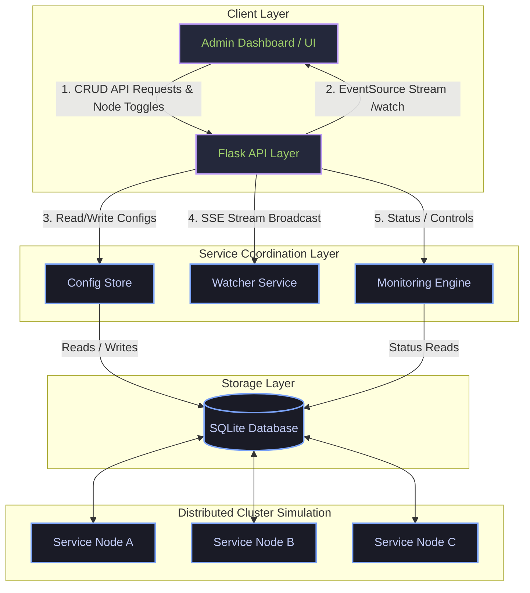
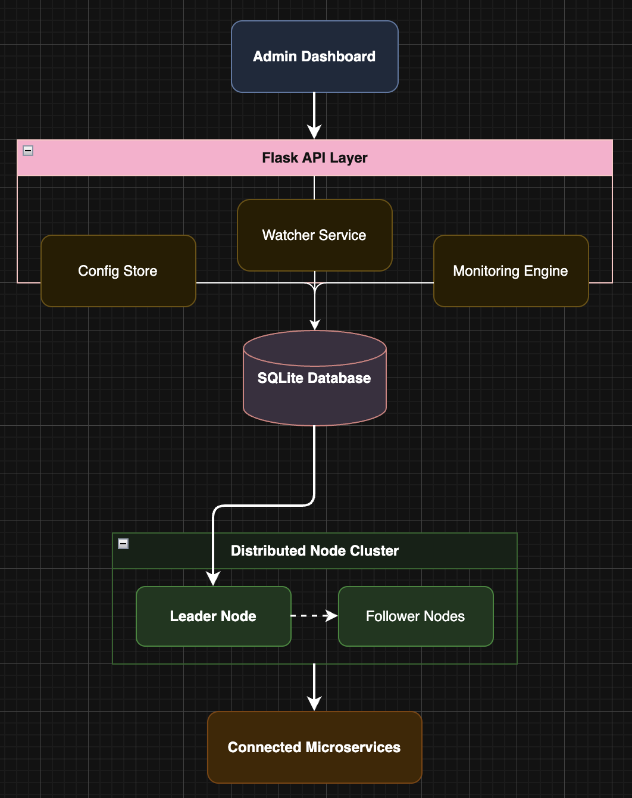
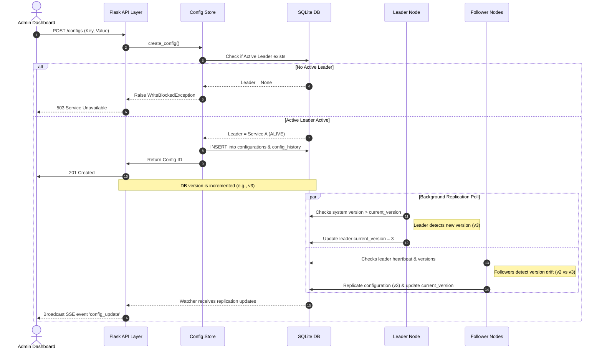
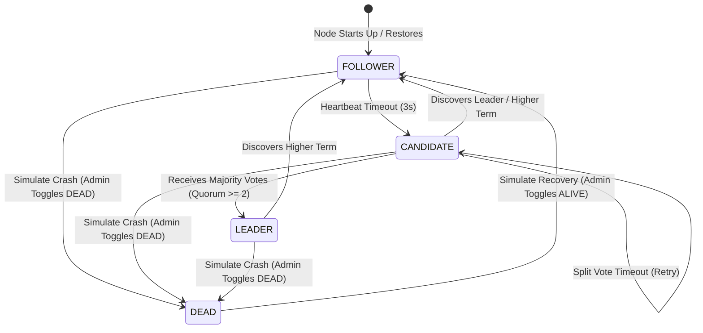
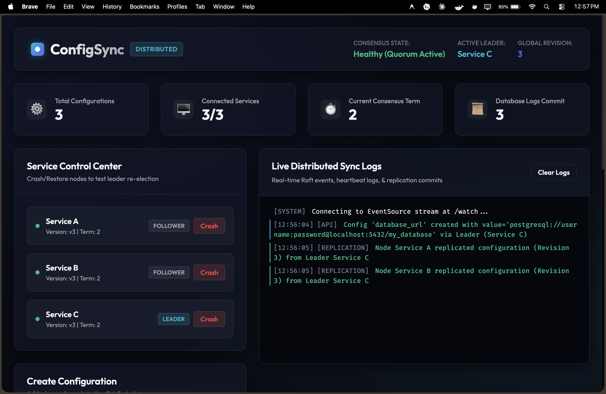

# ⚡ ConfigSync: Distributed Configuration Management Platform

**Project Documentation & System Design Case Study**  
*Centralized Configuration • Leader Election • Replication • Consensus • Real-Time Synchronization*

---

## 📖 Table of Contents
1. [Problem Statement](#1-problem-statement)
2. [Proposed Solution](#2-proposed-solution)
3. [System Architecture](#3-system-architecture)
4. [Module Description](#4-module-description)
5. [Database Design](#5-database-design)
6. [Technology Stack](#6-technology-stack)
7. [Implementation Details](#7-implementation-details)
8. [Screenshots & Demonstration Guide](#8-screenshots--demonstration-guide)
9. [Future Scope](#9-future-scope)
10. [Conclusion](#10-conclusion)

---

## 1. Problem Statement

In modern microservices architectures, managing application configurations (such as database credentials, feature flags, API endpoints, and timeouts) dynamically across dozens or hundreds of servers is highly challenging. 

### Core Challenges:
1. **Consistency Drift**: Individual services reading configurations from static local files or independent caches easily get out of sync during runtime updates, leading to inconsistent system behavior (split-brain).
2. **Slow Propagation & Downtime**: Redeploying or restarting applications to load new configurations causes service downtime, increases deployment overhead, and creates operational latency.
3. **No Audit Trail**: The lack of configuration version control and quick rollback capabilities makes recovering from incorrect configuration updates slow, manual, and risky.
4. **Single Point of Failure (SPOF)**: A centralized configuration server that is not replicated or highly available can crash, causing the entire distributed application to fail.
5. **Network Partitions**: During network splits, distributed configuration stores must trade off between availability and consistency (CAP Theorem) to prevent inconsistent configuration states.

---

## 2. Proposed Solution

**ConfigSync** resolves these challenges by providing a highly available, replicated configuration store with real-time watch notifications, audit histories, consensus-driven leader elections, and point-in-time recovery rollbacks. 

It implements a self-healing, multi-node configuration platform inspired by production engines like **Apache ZooKeeper** and **etcd**.

### Key Solutions Provided:
* **Consensus & Leader Election**: Simulates a three-node distributed cluster that automatically elects a leader. It detects leader heartbeat timeouts and node crashes, triggering self-healing elections.
* **Replication Status**: Tracks and verifies configuration propagation across all nodes. Displays synchronization delays and identifies out-of-sync nodes in real-time.
* **Audit Trails & Versioning**: Maintains full change history of configurations (`CREATE`, `UPDATE`, `DELETE`, `ROLLBACK`) with auto-incrementing versions.
* **Point-in-Time Recovery (PITR)**: Allows reverting the entire configuration store back to a specific global revision ID.
* **Server-Sent Events (SSE) Watcher**: Subscribes the web dashboard to server-side events, enabling instant updates of stats, tables, and logs without browser polling.
* **CAP Theorem Demonstration**: Restricts write operations during partitions (no active leader or majority quorum) to enforce strong consistency.

---

## 3. System Architecture

ConfigSync implements a multi-tier distributed architecture consisting of a frontend administration client, a Flask web API layer, and a simulated cluster of three backend nodes communicating through a shared database status medium.

### 3.1 Architectural Diagram
Below is the system architecture diagram illustrating the interaction between components:



#### Raw System Design Architecture
You can also view the high-level architecture diagram file located in the workspace:


---

### 3.2 Sequence Diagram: Write & Replication Flow
This diagram illustrates the sequence of operations when a new configuration is proposed:



---

### 3.3 Node Lifecycle & Consensus State Machine
This diagram shows how individual node threads transition between states based on heartbeat monitoring and votes:



---

## 4. Module Description

The project files are modularized for clean separation of concerns.

### 4.1 Frontend UI / Administration Dashboard
* **Files**: [index.html](file:///Users/atharvagahine/Desktop/Configuration-Management-Platform/templates/index.html), [style.css](file:///Users/atharvagahine/Desktop/Configuration-Management-Platform/static/style.css), [script.js](file:///Users/atharvagahine/Desktop/Configuration-Management-Platform/static/script.js)
* **Description**: A modern dark-mode admin panel using glassmorphic styling, animated stat cards, CSS grid layout, and custom scrollbars. 
* **Key Components**:
  * **System Status Bar**: Shows consensus state (Healthy vs Degraded), active leader, and global revision number.
  * **Service Control Center**: Interactive panel to toggle simulated node states (`ALIVE`/`DEAD`).
  * **Log Terminal**: Real-time console that parses incoming SSE events to print stylized heartbeats, replication steps, and consensus logs.
  * **Configuration Manager**: Form to add configurations, table to edit/delete configurations, and input for Point-in-Time rollbacks.

### 4.2 Flask API Layer
* **File**: [app.py](file:///Users/atharvagahine/Desktop/Configuration-Management-Platform/app.py)
* **Description**: Serves as the web server and entry point. It maps incoming HTTP endpoints to configuration commands, coordinates server-side Event Streams (SSE), and initializes background simulator threads.

### 4.3 Configuration Transaction Store
* **File**: [config_store.py](file:///Users/atharvagahine/Desktop/Configuration-Management-Platform/config_store.py)
* **Description**: Coordinates configuration database operations. Enforces write locking by checking cluster status (only permitting database inserts/updates if there is a healthy leader). Contains the database query algorithms for parsing history tables and rolling back keys.

### 4.4 Distributed Node Simulator
* **Files**: [node_simulator.py](file:///Users/atharvagahine/Desktop/Configuration-Management-Platform/services/node_simulator.py), [service_a.py](file:///Users/atharvagahine/Desktop/Configuration-Management-Platform/services/service_a.py), [service_b.py](file:///Users/atharvagahine/Desktop/Configuration-Management-Platform/services/service_b.py), [service_c.py](file:///Users/atharvagahine/Desktop/Configuration-Management-Platform/services/service_c.py)
* **Description**: Models the cluster nodes. Each node runs in its own background thread (`threading.Thread`) and uses the SQLite database as a shared state space to coordinate heartbeats, track election terms, cast votes, and pull replicated data revisions.

### 4.5 Real-Time Watcher (SSE Coordinator)
* **File**: [watcher.py](file:///Users/atharvagahine/Desktop/Configuration-Management-Platform/watcher.py)
* **Description**: Implements a thread-safe multi-listener subscription pool. Utilizes a lock guarded list of queues (`queue.Queue`) to buffer and dispatch events synchronously to all active EventSource streams.

### 4.6 SQLite Database Initializer
* **File**: [database.py](file:///Users/atharvagahine/Desktop/Configuration-Management-Platform/database.py)
* **Description**: Creates database tables (`configurations`, `config_history`, `services`), seeds node profiles on startup, and enables Write-Ahead Logging (WAL) mode to allow concurrent read/write actions by Flask and simulator threads.

---

## 5. Database Design

ConfigSync utilizes SQLite (`config.db`) as its persistence engine. The schema contains three tables designed to represent active configurations, change histories, and cluster metadata.

```
       +--------------------+          +--------------------+
       |   configurations   |          |   config_history   |
       +--------------------+          +--------------------+
       | id (PK)            |<---------| id (PK)            |
       | key (Unique)       |          | config_id (FK)     |
       | value              |          | key                |
       | description        |          | value              |
       | version            |          | version            |
       | updated_at         |          | change_type        |
       +--------------------+          | changed_at         |
                                       +--------------------+

                                       +--------------------+
                                       |      services      |
                                       +--------------------+
                                       | id (PK)            |
                                       | name               |
                                       | role               |
                                       | status             |
                                       | last_heartbeat     |
                                       | current_version    |
                                       | term               |
                                       | voted_for          |
                                       +--------------------+
```

### 5.1 Tables Schema & Structures

#### 1. Table: `configurations`
Stores the active configuration keys, values, and current revisions.
* **SQL Create Statement**:
```sql
CREATE TABLE configurations (
    id INTEGER PRIMARY KEY AUTOINCREMENT,
    key TEXT UNIQUE NOT NULL,
    value TEXT NOT NULL,
    description TEXT,
    version INTEGER DEFAULT 1,
    updated_at DATETIME DEFAULT CURRENT_TIMESTAMP
);
```
* **Field Detail**:
| Field | Type | Constraint | Description |
|---|---|---|---|
| `id` | INTEGER | PRIMARY KEY, AUTOINCREMENT | Unique identifier for the configuration |
| `key` | TEXT | UNIQUE, NOT NULL | The key name (e.g., `database_url`) |
| `value` | TEXT | NOT NULL | The active config value |
| `description` | TEXT | NULLABLE | Human-readable explanation |
| `version` | INTEGER | DEFAULT 1 | Version counter incremented on updates |
| `updated_at` | DATETIME | DEFAULT CURRENT | Timestamp of last modification |

---

#### 2. Table: `config_history`
Stores the changelog log (audit trail) for version control and Point-in-Time recovery.
* **SQL Create Statement**:
```sql
CREATE TABLE config_history (
    id INTEGER PRIMARY KEY AUTOINCREMENT,
    config_id INTEGER NOT NULL,
    key TEXT NOT NULL,
    value TEXT NOT NULL,
    version INTEGER NOT NULL,
    change_type TEXT NOT NULL, -- 'CREATE', 'UPDATE', 'DELETE', 'ROLLBACK'
    changed_at DATETIME DEFAULT CURRENT_TIMESTAMP
);
```
* **Field Detail**:
| Field | Type | Constraint | Description |
|---|---|---|---|
| `id` | INTEGER | PRIMARY KEY, AUTOINCREMENT | The global revision/commit number |
| `config_id` | INTEGER | NOT NULL | Reference link to the configurations ID |
| `key` | TEXT | NOT NULL | Key of the configuration at this revision |
| `value` | TEXT | NOT NULL | Value of the configuration at this revision |
| `version` | INTEGER | NOT NULL | Version of the config key at this revision |
| `change_type` | TEXT | NOT NULL | Action type: `CREATE`, `UPDATE`, `DELETE`, `ROLLBACK` |
| `changed_at` | DATETIME | DEFAULT CURRENT | Revision timestamp |

---

#### 3. Table: `services`
Stores node metadata, election terms, heartbeats, and current version states.
* **SQL Create Statement**:
```sql
CREATE TABLE services (
    id TEXT PRIMARY KEY,
    name TEXT NOT NULL,
    role TEXT NOT NULL,       -- 'LEADER', 'FOLLOWER', 'CANDIDATE'
    status TEXT NOT NULL,     -- 'ALIVE', 'DEAD'
    last_heartbeat INTEGER,   -- Unix timestamp float/int
    current_version INTEGER,  -- Replicated version ID
    term INTEGER DEFAULT 0,   -- Raft Term number
    voted_for TEXT            -- Node voted for in current election
);
```
* **Field Detail**:
| Field | Type | Constraint | Description |
|---|---|---|---|
| `id` | TEXT | PRIMARY KEY | Service identifier (e.g. `service_a`) |
| `name` | TEXT | NOT NULL | Display name of the service (e.g. `Service A`) |
| `role` | TEXT | NOT NULL | Operational state: `LEADER`, `FOLLOWER`, `CANDIDATE` |
| `status` | TEXT | NOT NULL | Health status: `ALIVE`, `DEAD` |
| `last_heartbeat`| INTEGER | DEFAULT 0 | Unix timestamp of the last active loop execution |
| `current_version`|INTEGER | DEFAULT 0 | The latest database revision version synched by this node |
| `term` | INTEGER | DEFAULT 0 | Raft-like election term number |
| `voted_for` | TEXT | NULLABLE | Candidate node ID that this node voted for in current term |

---

## 6. Technology Stack

The ConfigSync platform is built with a lightweight and self-contained stack, allowing local executions with zero external network or database dependencies.

| Category | Technologies | Description / Details |
|---|---|---|
| **Programming Language** | Python 3.11 | Primary language for backend simulation and API development |
| **Web Framework** | Flask 3.0.3 | Web micro-framework to build REST APIs and serve templates |
| **Database Engine** | SQLite 3 | Embedded database running in WAL mode for shared state persistence |
| **Real-Time Data Delivery**| Server-Sent Events (SSE) | Unidirectional streaming protocol via EventSource standard |
| **Concurrencies** | threading, queue | Native Python threading module to execute parallel simulators |
| **Frontend Styling** | Vanilla CSS3 | Custom UI styling using dark theme, glassmorphic filters, and Flex/Grid layouts |
| **Typography** | Google Fonts | Outfit (headings, cards) and Fira Code (log terminals) |
| **Interactive Graphs** | Mermaid.js | Dynamic, markdown-embedded system architecture diagrams |
| **Development Tools** | Git, VS Code, Draw.io | Development environments, code versioning, and drawing modules |

---

## 7. Implementation Details

ConfigSync simulates distributed consensus and data replication concepts using background processes.

### 7.1 Leader Election Algorithm
Each node is modeled in [node_simulator.py](file:///Users/atharvagahine/Desktop/Configuration-Management-Platform/services/node_simulator.py). 

1. **Heartbeat Broadcast**: The `LEADER` updates its `last_heartbeat` column in the SQLite DB every 1 second.
2. **Failure Detection**: Every follower checks the leader's status. If the leader's node is `DEAD` or `(current_time - last_heartbeat) > 3` seconds, followers trigger a timeout.
3. **Candidate Transition**: The follower transition to `CANDIDATE`, increments the `term` number, votes for itself, and updates the database.
4. **Gathering Votes**: 
   * The candidate polls other `ALIVE` services.
   * Follower nodes grant their vote to a candidate if the candidate's term is greater than their own term.
5. **Elected Leader**: If the candidate receives a majority quorum of votes (e.g. 2 out of 3 total nodes):
   * It demotes the current leader (updates status in database).
   * It promotes itself to `LEADER`.
   * It begins heartbeats.

---

### 7.2 Pull-Based Configuration Replication
ConfigSync manages write accessibility using the CAP theorem model.
* **Write Restriction**: All modifications (`POST`, `PUT`, `DELETE`, `ROLLBACK`) verify leader status using `enforce_leader()`. If no leader exists (e.g. partition causes no quorum), writes are blocked.
* **Propagation**:
  * Upon write confirmation, the configuration is stored in the database, generating a new global revision (the primary key in `config_history` table).
  * Followers notice the mismatch between their `current_version` and the database's latest revision.
  * They pull the revision, update their internal replica state, and write their new `current_version` to the database.
  * A quorum is achieved when a majority of online nodes successfully update their replica versions.

---

### 7.3 Point-in-Time Recovery (PITR) Rollback
Point-in-Time Recovery enables an administrator to roll back the system to any past global revision ID.
The recovery query operates by reconstructing configurations using the audit history logs:

```sql
SELECT h.config_id, h.key, h.value, h.version, h.change_type
FROM config_history h
INNER JOIN (
    SELECT key, MAX(id) as max_id
    FROM config_history
    WHERE id <= :revision_id
    GROUP BY key
) latest ON h.id = latest.max_id;
```

#### Step-by-Step Recovery Logic:
1. Reconstructs key-value states that were active at or before the input `revision_id`.
2. Empties the active `configurations` table.
3. Re-inserts the historical keys (setting key descriptions to `"Restored from revision [ID]"`) and logs a `ROLLBACK` event into the history log.
4. Prompts followers to sync the restored state by triggering version propagation.

---

### 7.4 Server-Sent Events (SSE) Streaming
Instead of standard HTTP polling, the dashboard connects to `/watch` using HTML5 `EventSource`.
* The Flask route spawns a generator that listens to a thread-safe `queue.Queue`.
* Whenever a component logs a heartbeat, an election vote, or a config update, it calls `broadcast_event(event_type, data)` in [watcher.py](file:///Users/atharvagahine/Desktop/Configuration-Management-Platform/watcher.py).
* The event is immediately formatted as `data: {"type": "...", "timestamp": "...", "data": {...}}\n\n` and sent to the client browser over the persistent connection.

---

## 8. Screenshots & Demonstration Guide

### 8.1 Interface Screenshot
The interface features glassmorphism panels, interactive service toggles, configuration forms, and a live terminal console.



* **Key Interface Elements**:
  * **Top Metrics**: Displays Total Configs, Connected Nodes, Consensus Term, and Database Log Revision.
  * **Service Control Center (Left)**: Renders nodes, their current role, term, synced version, and action button.
  * **Log Terminal (Right)**: Streams real-time event logs with distinct level colors (blue, green, yellow, red).
  * **Config Store (Bottom)**: Lists active keys, values, and features native modal editing.

---

### 8.2 Demonstration Walkthrough
You can demonstrate the system design features using these steps:

1. **Bootstrap & Leader Election**:
   * Open the dashboard at `http://127.0.0.1:5000`.
   * Observe the *Live Distributed Sync Logs* terminal. Note how nodes startup, detect no active leader, trigger an election, and elect a leader (e.g. Service A) in Term 1.
2. **Configuration Addition & Replication**:
   * Add a configuration key `api_key` with value `xyz-123` and click **Propose & Propagate**.
   * Watch the log terminal print the write request, leader-initiated propagation, follower sync notifications, and quorum confirmations.
3. **Simulate Node Failures (Leader Crash)**:
   * Locate the active `LEADER` node in the Service Control Center.
   * Click **Crash** to toggle its status to `DEAD`.
   * Watch the log console. After 3 seconds of leader silence, followers detect the timeout.
   * Follow the logs as a follower transitions to `CANDIDATE`, holds an election, gathers votes, and is promoted to `LEADER` for Term 2.
4. **CAP Theorem Partition Block**:
   * Click **Crash** on a second node. Only one node remains active.
   * Because 1/3 nodes is less than the required majority quorum (2/3), the consensus state changes to `DEGRADED`.
   * Attempt to create a new configuration. The UI will show a `503 Service Unavailable` error, showing how the system prioritizes consistency over availability during partitions.
5. **Node Recovery & Catch-up**:
   * Click **Recover** on the dead nodes.
   * Watch the recovered nodes resume, re-join the consensus, elect a leader, and automatically pull the latest configuration revisions they missed while offline.
6. **Point-in-Time Rollback**:
   * Update some keys to generate multiple revisions (visible in the "Database Logs Commit" stat).
   * Enter a past revision ID in the **Point-in-Time Rollback** box and click **Rollback**.
   * Verify that the active configurations revert to the exact values they held at that point in time.

---

## 9. Future Scope

While ConfigSync successfully demonstrates core distributed system concepts, future enhancements could expand it into a production-grade service:

1. **Socket-Based Consensus Engine**: Replace the shared SQLite database consensus medium with real socket-based TCP connections between nodes, simulating actual network latency and packet loss.
2. **Full Raft Algorithm implementation**: Expand the consensus simulation to include full Raft features like Log Append entries, Leader completeness safety, and term boundaries.
3. **Role-Based Access Control (RBAC)**: Protect configuration writes with authorization schemes, API keys, and JWT authentication tokens.
4. **Docker & Kubernetes Integration**: Package nodes as separate Docker containers and run them on Kubernetes to test replica state synchronization in actual containerized environments.
5. **Observability Stack**: Integrate Prometheus metrics and pre-configured Grafana dashboards to monitor heartbeats, replication latencies, and term durations.
6. **Encrypted Configuration Values**: Add client-side or database-level AES encryption to protect sensitive credentials (secret keys, passwords) at rest.

---

## 10. Conclusion

ConfigSync successfully demonstrates the design and implementation of a distributed configuration management service. The system provides centralized configuration storage, real-time synchronization, leader election, replication, fault tolerance, version control, and rollback capabilities.

The project effectively applies distributed systems concepts inspired by Apache ZooKeeper and etcd while providing a practical and interactive platform for understanding modern configuration management architectures. This implementation fulfills the requirements of the System Design case study and serves as a scalable foundation for future enhancements.

---
**Project Developer**: Atharva P. Gahine  
**Institution**: ITM Skills University  
**Degree**: B.Tech Computer Science & Engineering  
